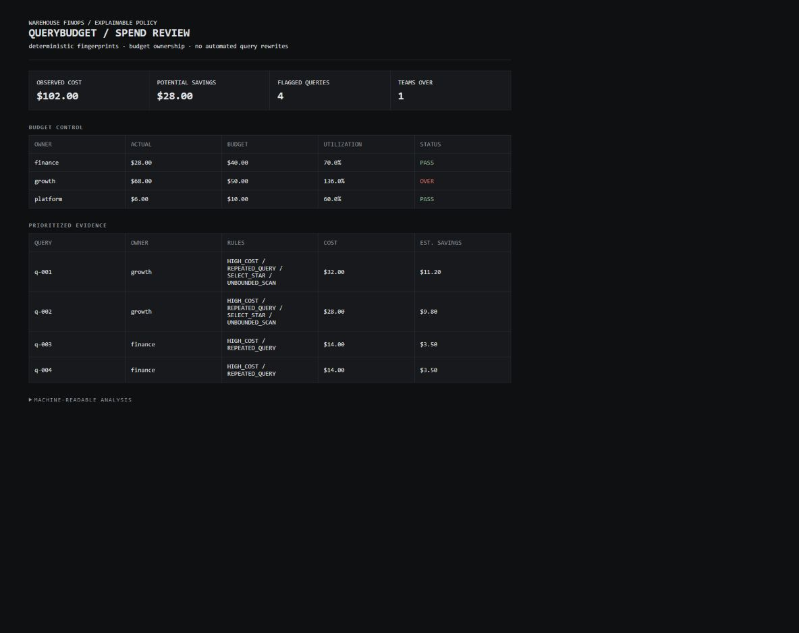

# QueryBudget — Explainable Warehouse FinOps

[](https://github.com/Arturo6PR/querybudget/actions/workflows/ci.yml)

> A deterministic warehouse-spend analyzer that assigns cost to owners, fingerprints repeated SQL, explains optimization findings, and enforces team budgets in CI.



## The operating problem

Warehouse cost alerts often arrive after spend has already escaped, while recommendation tools produce suggestions with unclear assumptions. QueryBudget turns query history into an auditable decision:

```text
observed query history
        ↓
stable SQL fingerprint → explicit rules → conservative savings estimate
        ↓                                      ↓
team budget status                    prioritized evidence
```

It never rewrites or executes a query. It reports what triggered, which owner pays for it, and how the estimate was calculated.

## Sixty-second demonstration

```bash
python -m querybudget demo
python -m unittest discover -s tests -v
```

The demo intentionally returns exit code `1` because Growth is over budget. It analyzes six query-history records, finds two repeated fingerprints, prioritizes four queries, and estimates $28.00 of potential savings from $102.00 of observed spend.

Open `artifacts/querybudget-report.html` for the engineering review.

## Policy model

| Rule | Trigger | Conservative savings assumption |
|---|---|---:|
| `UNBOUNDED_SCAN` | no `WHERE` and at least 100 GB scanned | 35% |
| `REPEATED_QUERY` | normalized fingerprint appears more than once without cache | 25% |
| `SELECT_STAR` | projection contains `SELECT *` | 15% |
| `HIGH_COST` | query costs at least $10 | 10% |

Per-query estimates use the highest applicable rate rather than summing percentages. That avoids presenting overlapping findings as additive savings.

## Controls and evidence

| Concern | Implementation | Evidence |
|---|---|---|
| Ownership | every query maps to a team and warehouse | budget table by owner |
| Repeated work | literals and whitespace normalized before hashing | stable 12-character fingerprint |
| Explainability | named rules, thresholds, and rates | rule list on every finding |
| Budget enforcement | `PASS`, `WARN`, or `OVER` per team | nonzero CLI exit when any team is over |
| Estimate honesty | maximum overlapping rate per query | policy and calculation included in output |
| Portability | vendor-neutral query-history contract | JSON input and standard-library implementation |

## Analyze your own export

```bash
python -m querybudget analyze query-history.json budgets.json \
  --output artifacts/team-spend.html
```

Input fields are defined in [`contracts/query-history.schema.json`](contracts/query-history.schema.json). Thresholds live in [`policies/query-policy.json`](policies/query-policy.json).

## Repository map

```text
querybudget/        fingerprinting, rules, budget evaluation, CLI, report
contracts/          vendor-neutral query-history contract
policies/           visible thresholds and savings assumptions
tests/              normalization, findings, budget, and validation tests
docs/               decisions, optimization playbook, interview guide
.github/workflows/  hosted policy check
```

## Honest scope

The SQL normalization is intentionally heuristic, not a full parser, and savings are policy estimates rather than measured billing reductions. Production adoption should ingest warehouse-native query plans, validate recommendations with before/after measurements, and tune rates using observed results.
